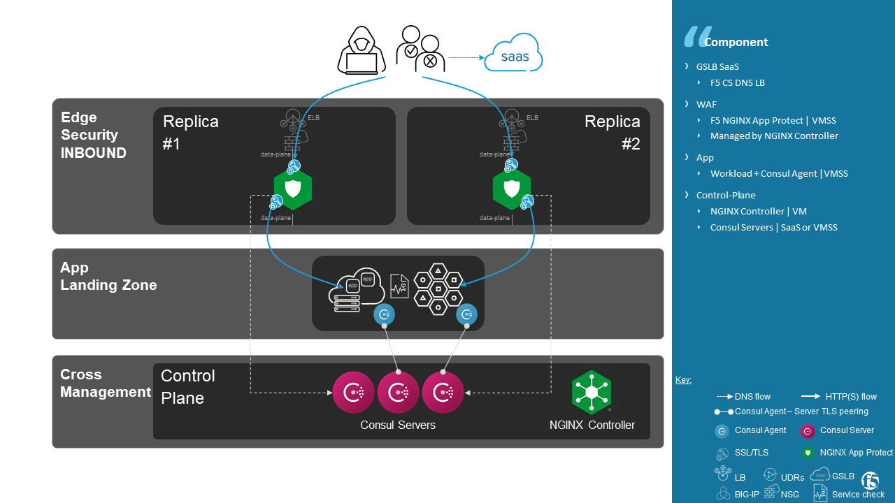
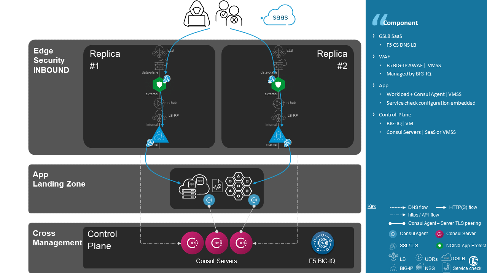

Service Discovery - F5 + Consul
==================================================
.. contents:: Table of Contents

Summary
==================================================
Use Case
###############
- **Dynamism** -- Discover workloads IP address and port where the service is up and running in acceptable conditions
- **Role Base Access Control** -- Delegate Monitoring configuration to DevOps
- **Source of Truth** -- Centralize application state in an Out Of Band registry

Benefit
###############
- **Multi-Cloud** -- useo one solution On Premise and in Cloud providers
- `Circuit Breaker pattern <https://www.nginx.com/blog/microservices-reference-architecture-nginx-circuit-breaker-pattern/>`_ -- monitor your application services and the traffic flowing among them in order to prevent failures
- **Automation** -- monitor setup belongs to app landing zone

Architecture
###############
NGINX App Protect + Consul
*********************

BIG-IP + Consul
*********************

Ecosystem
*********************
- NGINX+
- NGINX App Protect
- NGINX Controller + Application Delivery licence
- Ansible Tower
- Consul by Hashicorp

Demo
###############
NGINX App Protect + Consul
**************************
:kbd:`ToDo`

.. raw:: html

    

BIG-IP + Consul
*********************
:kbd:`ToDo`

.. raw:: html

    

Pre-requisites
==============

NGINX Controller
##############
`install guide <https://github.com/MattDierick/docker-nginx-controller>`_

Ansible Tower
##############

Azure azure_preview_modules
***************************
This role is the most complete and includes all the latest Azure modules. The update and bug fix are done in a more timely manner than official Ansible release.
If you use Ansible for Azure resource provisioning purpose, you're strongly encouraged to install this role.
Follow `install guide <https://github.com/Azure/azure_preview_modules>`_

.. code:: bash

    $ sudo ansible-galaxy install azure.azure_preview_modules
    $ sudo /var/lib/awx/venv/my_env/bin/pip install -U -r /etc/ansible/roles/azure.azure_preview_modules/files/requirements-azure.txt
    $ sudo /var/lib/awx/venv/my_env/bin/pip show azure-mgmt-compute

If ``azure-mgmt-compute`` < ``10.0.0`` then use last update from azure_preview_modules repo and not from Galaxy.
``/etc/ansible/roles/`` is an example of an Tower installation where ``roles`` are located.

.. code:: bash

    $ sudo cd /etc/ansible/roles/
    $ sudo git clone https://github.com/Azure/azure_preview_modules.git
    $ sudo /var/lib/awx/venv/my_env/bin/pip install -r /etc/ansible/roles/azure.azure_preview_modules/files/requirements-azure.txt
    $ sudo vi /etc/ansible/roles/azure.azure_preview_modules/defaults/main.yml
        skip_azure_sdk: false

Consul
***************************

.. code:: bash

    $ sudo /var/lib/awx/venv/my_env/bin/pip install python-consul

Role structure
**************
- Deployment is based on ``workflow template``. Example: ``workflow template``=``wf-create_create_edge_security_inbound`` ;
- A ``workflow template`` includes multiple ``job template``. Example: ``job template``=``poc-azure_create_hub_edge_security_inbound``
- A ``job template`` have an associated ``playbook``. Example: ``playbook``=``playbooks/poc-azure.yaml``
- A ``playbook`` launch a ``play`` in a ``role``. Example: ``role``=``poc-azure``

.. code:: yaml

    - hosts: localhost
      gather_facts: no
      roles:
        - role: poc-azure

- A ``play`` is an ``extra variable`` named ``activity`` and set in each ``job template``. Example: ``create_hub_edge_security_inbound``
- The specified ``play`` (or ``activity``) is launched by the ``main.yaml`` task located in the role ``tasks/main.yaml``

.. code:: yaml

    - name: Run specified activity
      include_tasks: "{{ activity }}.yaml"
      when: activity is defined

- The specified ``play`` contains ``tasks`` to execute. Example: play=``create_hub_edge_security_inbound.yaml``

Consul by Hashicorp
###################
Choose your install guide: customized from `Consul install guide<https://learn.hashicorp.com/consul/datacenter-deploy/deployment-guide#install-consul>`_ or automated (below) with Ansible

Credential
**************************
Create custom credential `cred_Consul` to manage access to Consul VMs

=====================================================   =============================================       =============================================   =============================================   =============================================
CREDENTIAL TYPE                                            USERNAME                                           SSH PRIVATE KEY                                        SIGNED SSH CERTIFICATE                                        PRIVILEGE ESCALATION METHOD
=====================================================   =============================================       =============================================   =============================================   =============================================
``Machine``                                             ``my_VM_admin_user``                                ``my_VM_admin_user_key``                        ``my_VM_admin_user_CRT``                        ``sudo``
=====================================================   =============================================       =============================================   =============================================   =============================================

Workflow and Job Templates
**************************
Create a worflow template `wf-create_create_cluster_consul` that includes each of those job template:

=============================================================   =============================================       =============================================   =============================================   =============================================   =============================================   =============================================
Job template                                                    objective                                           playbook                                        activity                                        inventory                                       limit                                           credential
=============================================================   =============================================       =============================================   =============================================   =============================================   =============================================   =============================================
``poc-azure_create-vm-consul``                                  Create Consul servers VMs                           ``playbooks/poc-azure.yaml``                    ``create-vm-consul``                            ``localhost``                                   ``localhost``                                   ``my_azure_credential``
``poc-consul_install``                                          Install Consul service                              ``playbooks/poc-consul.yaml``                   ``install``                                                                                                                                     ``cred_Consul``
``poc-consul_initialize_tls_encryption``                        Generate CA                                         ``playbooks/poc-consul_master.yaml``            ``initialize_tls-ca_gen``                                                                                                                       ``cred_Consul``
``poc-consul_onboard``                                          Configure Consul as a Server                        ``playbooks/poc-consul.yaml``                   ``onboard``                                                                                                                                     ``cred_Consul``
=============================================================   =============================================       =============================================   =============================================   =============================================   =============================================   =============================================

Extra variables
**************************
==============================================  =============================================   ================================================================================================================================================================================================================
Extra variable                                  Description                                     Example
==============================================  =============================================   ================================================================================================================================================================================================================
``extra_key_data``                              admin user auth CRT                             ``-----BEGIN  CERTIFICATE-----XXXXXXX-----END CERTIFICATE-----``
``extra_location``                              region                                          ``eastus2``
``extra_platform_name``                         datacenter name                                 ``myPlatform``
``extra_platform_tags``                         VM tags                                         ``environment=DMO platform=Inbound project=CloudBuilderf5``
``extra_subnet_mgt_on_premise``                 Tower subnet                                    ``10.0.0.0/24``
``extra_vm_size``                               VM type                                         ``Standard_DS1_v2``
``extra_vm_size``                               VM type                                         ``Standard_DS1_v2``
``infra_admin_username``                        Admin username                                  ``plop``
``extra_subnet_mgt_dataplane``                  Consul subnet                                   ``10.100.0.0/24``
``extra_consul_cluster``                        Consul cluster configuration                    see below
==============================================  =============================================   ================================================================================================================================================================================================================

.. code:: yaml

    extra_consul_cluster:
      members:
        <logical_name>:
          az: <AZ list>
          ip_mgt: <management IP>
          master: [true | false]
          role: [client | server]
          vm_name: <VM_name>
      version: <Consul version to download>
      vm_master_ip_mgt: <management IP of the master Consul VM>

Example:

.. code:: yaml

    extra_consul_cluster:
      members:
        server-1:
          az:
            - 1
          ip_mgt: 10.100.0.60
          master: true
          role: server
          vm_name: consul-server-1
        server-2:
          az:
            - 2
          ip_mgt: 10.100.0.61
          master: false
          role: server
          vm_name: consul-server-2
      version: 1.8.4
      vm_master_ip_mgt: 10.100.0.60

Edge Security
###################
Follow the guide `Deploy a replica of Edge Security<https://github.com/nergalex/f5-autoscale-azure#deploy-a-replica-of-edge-security>`_

Reposiroty for Consul Client
############################
During bootstrapping, each VM of the VMSS download a `repository<https://github.com/nergalex/consul-bootstrap>`_ (git clone) and execute scripts in order to:
- install Consul client
- onboard Consul client and attached it to Consul cluster
- configure Application Services and associated monitoring

Use Case
==================================================

A) NGINX App Protect + Consul
#############################
Follow the guide `Deploy an Application<https://github.com/nergalex/f5-autoscale-azure#deploy-an-application>`_ using specifically:

==============================================  =============================================   ================================================================================================================================================================================================================
Extra variable                                  Description                                     Example
==============================================  =============================================   ================================================================================================================================================================================================================
``extra_app``                                   App specification                               see below
``extra_app_backend``                           VM extension for VMSS App                       ``arcadia_consul_1nic_bootstrapping.jinja2``
==============================================  =============================================   ================================================================================================================================================================================================================

.. code:: yaml

    extra_app:
      components:
        - name: north
          type: adc
          uri: /
          template: component_adc_consul.json
          service_disovery: arcadia-all-in-one

B) BIG-IP + Consul
==================================================

:kbd:`ToDo`

